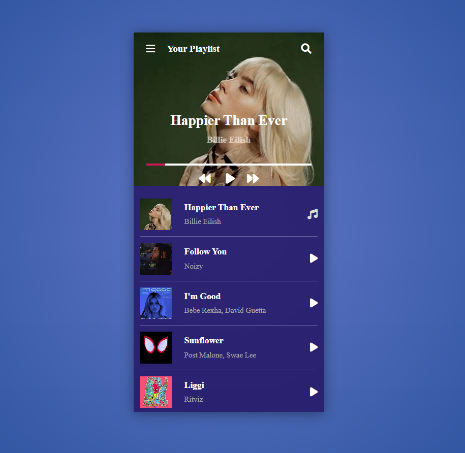

# Music Player 🎵

A simple and interactive music player built with HTML, CSS, and JavaScript. This project allows users to play, pause, and navigate through their favorite songs with an intuitive interface.

---

## Features ✨

- 🎶 Play, pause, and stop music.
- ⏭️ Skip to the next or previous track.
- 🎨 Responsive and user-friendly design.

---

## Technologies Used 🛠️

- **HTML**: For structuring the music player interface.
- **CSS**: For styling and making the player visually appealing.
- **JavaScript**: For adding interactivity and functionality.

---

## How to Use 🚀

1. Clone the repository:
```bash
   git clone https://github.com/priyalrajpara/music_player.git
  ```
2. Open the `index.html` file in your browser to view the music player.


## **Folder Structure**
```
music_player/
├── index.html       # Main HTML file
├── style.css        # CSS file for styling
├── script.js        # JavaScript file for interactivity
├── LICENSE          # License file
└── README.md        # Project documentation
```

## **Screenshots**


## **License**
This project is licensed under the MIT License. Feel free to use or modify it.

## **Author**
Created by [Priyal Rajpara](https://github.com/priyalrajpara).

